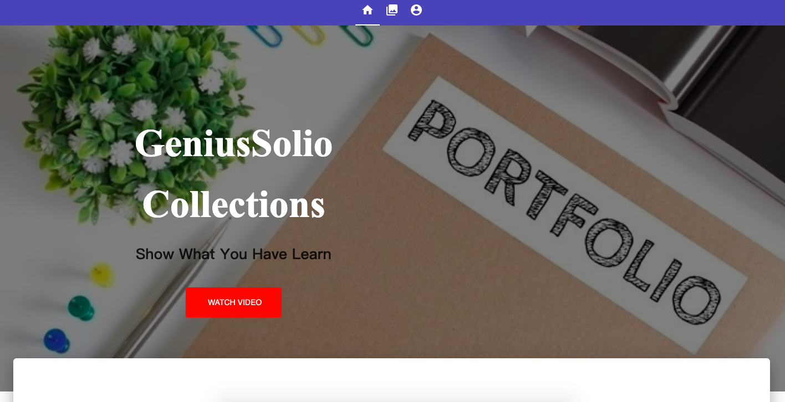
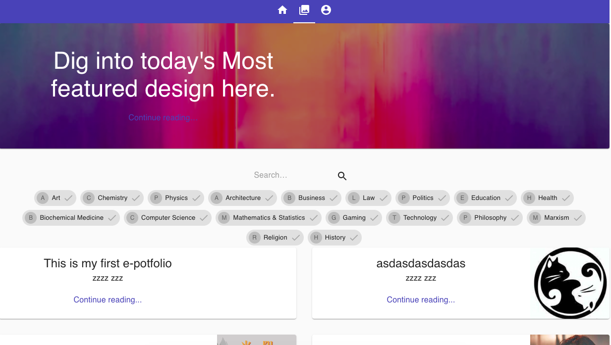
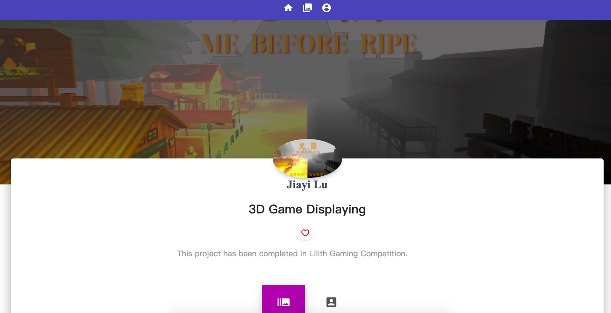
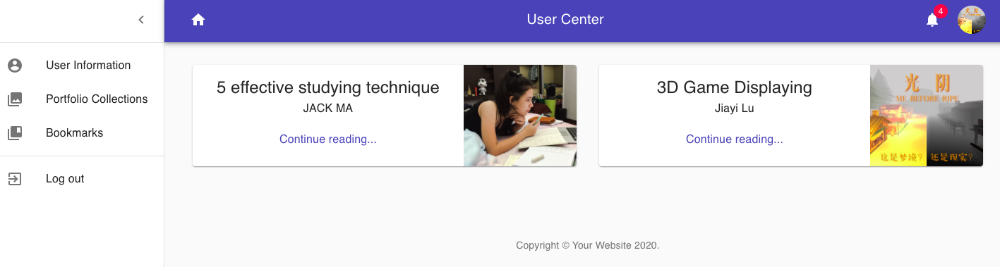
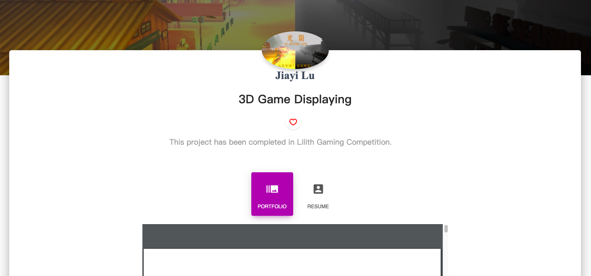
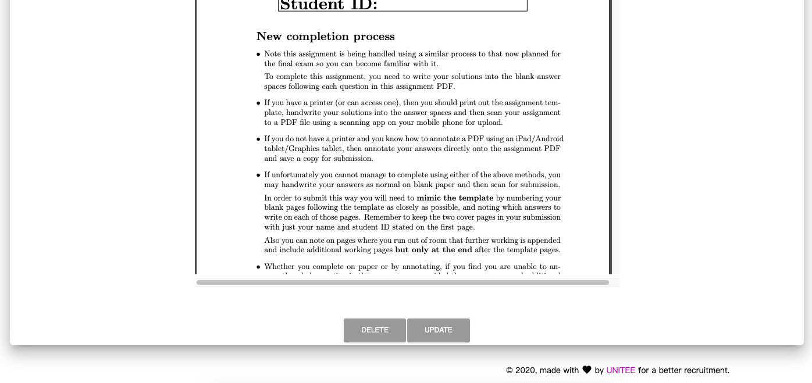
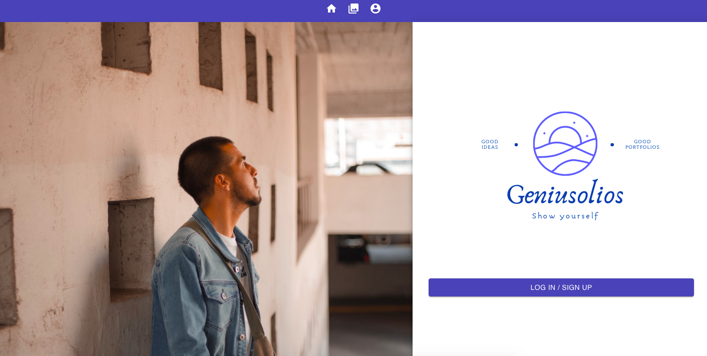
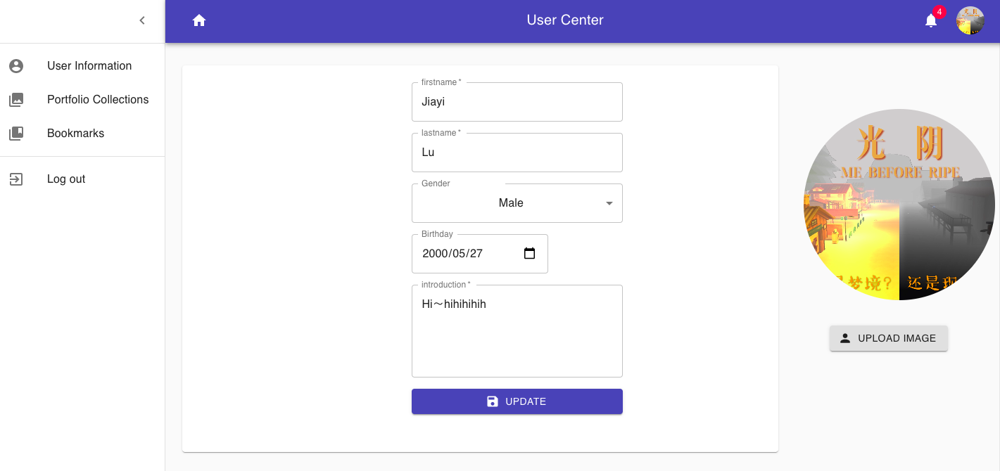
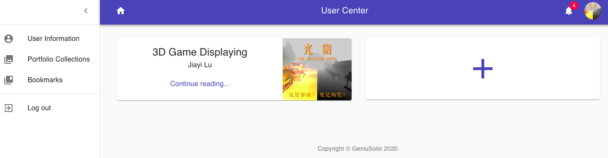
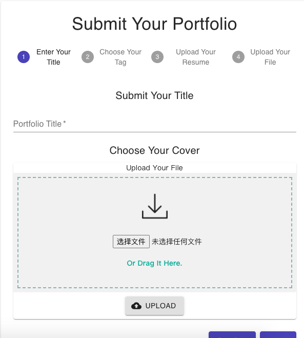

# IT-Project-Front-end

Modern, open-source ePortfolio system built - GeniuSolios by unimelb students for capstone subject COMP30022. You can check at https://genius-solio.herokuapp.com/ .


**Built with:** NodeJS, Express, MongoDB, ReactJS and Material-UI

## Getting Started

### Dependencies

- [npm](https://www.npmjs.com/get-npm) and [Node.js](https://nodejs.org/en/)

  - This project is built on Node.js and React

  - Verify installation with

    ```bash
    $ node -v
    v12.16.3 (or other version number)
    $ npm -v
    6.14.4 (or other version number)
    ```
After you've forked and cloned the repository, run the following commands:

    `npm install` - downloads the required libraries/modules

Then, as Material-UI is also available as an [npm package](https://www.npmjs.com/package/@material-ui/core), run the following commands:

    npm install @material-ui/core

Finally, run the command:
    
    npm start

## Main Features

### User HomePage Feature

The left button on the navigation bar is the homepage, which contains a description about the website 
and what can this website do for the users.



### User Blog Feature

The middle button on the navigation bar is the user blog page, which used to display user's portfolio.



The user can have a look upon the portfolio list on this page, each portfolio contains a title, a cover and the
author's name. There is a tag list under the search bar, and the user could easily choose the tags to filter the target portfolio.
We also allow our users to search the keywords to find portfolios which they are interested in.

#### Single Portfolio Page
The user can visit any portfolio page from the portfolio list page by clicking the portfolio.



The user can click the red-heart button to bookmark the portfolio, and it will be added to user's Bookmark page in user center 
for visiting it again later on.



The user can read the portfolio by clicking the switch button "PORTFOLIO" and author's resume by switching to "RESUME" button.



Also they could choose to update or delete their own portfolios by clicking the corresponding buttons below.



### User Center Feature

The third button on the navigation bar is the Signup/Login or user center feature.

#### Signup/Login page

If users haven't signed up/logged in, when they click this button, the page will link to the signup/login page.



In this page, user could click login/signup button, then the page will link to auth0 api which user could use to login/signup.

#### User Center Page

If users have already logged in, when they click this button, the page will link to their user center.
    


In user center page, we developed several sub pages, the first one and also the default one is the User Information page, 
users could update their personal information and avatar image there.

The second one is the Portfolio Collections page, users could upload their portfolios there, 
and also the portfolios will be stored at this page where they can check what they have posted later.
 


The user can click "+" button in this page to upload portfolios with cover image, title, tag, description and resume.



The third one is Bookmarks page, users could see the portfolios displayed there which they has marked before.


 ## Authors
 
 - [Jiayi Lu](https://github.com/Jiayi-Joyce-Lu)
 - [Zhiqing Wu](https://github.com/zhiqingw)
 - [Wei Zhang](https://github.com/Proletariatee)
 - [Xuxu Xue](https://github.com/ElliotXue)
 - [Mingyue Gu](https://github.com/gmy0516)


